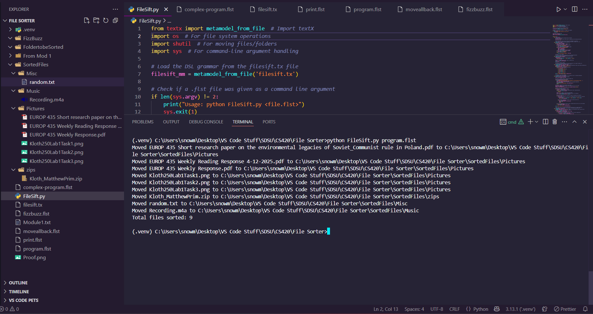

<html lang="en">
<head>
  <meta charset="UTF-8">
  <title>FileSift</title>
  
</head>
<body>

  <h1>FileSift</h1>
  
A simple language to assist with dealing with or sorting files

  <!-- Clickable image linking to YouTube -->
  

  <h2>Example</h2>
  
  

  <h2>View The Slides</h2>
  <iframe 
    src="https://docs.google.com/presentation/d/e/2PACX-1vQB96CV3sjGqoNEO43GI6c1CjNaFmDfuBdDDmKKqNibkx1i8G_a6knX_OcUBH6iOq7aKQ4kvR42B4E8/pubembed?start=false&loop=false&delayms=30000" 
    frameborder="0" width="960" height="569" 
    allowfullscreen="true" mozallowfullscreen="true" webkitallowfullscreen="true">
  </iframe>

  <h2>Video Example</h2>
  <video width="1000" controls>
    <source src="docs/assets/video1440680598 - TrimEND.mp4" type="video/mp4">
    Your browser does not support the video tag.
  </video>

</body>
</html>
